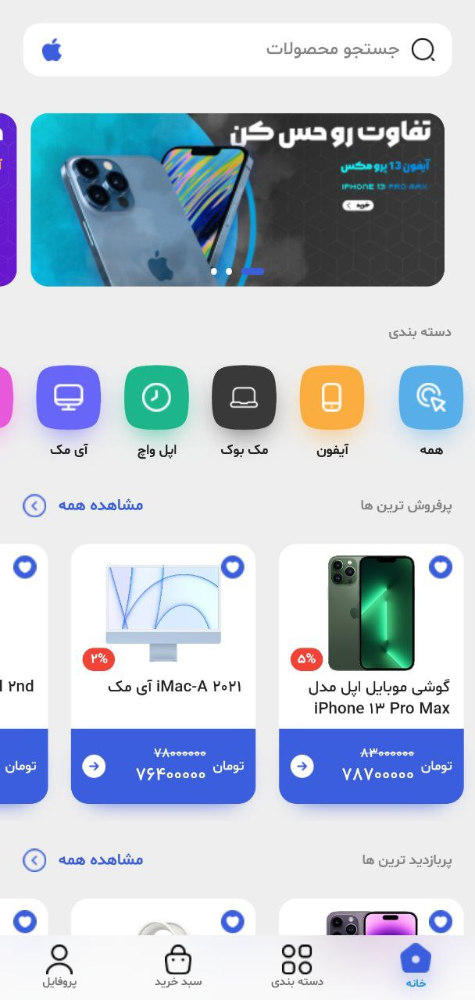
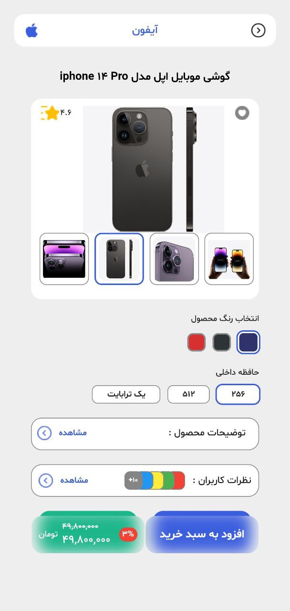
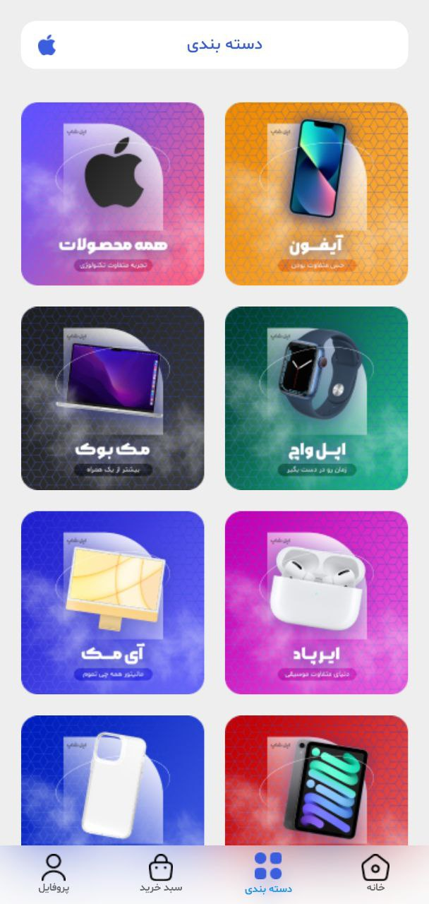
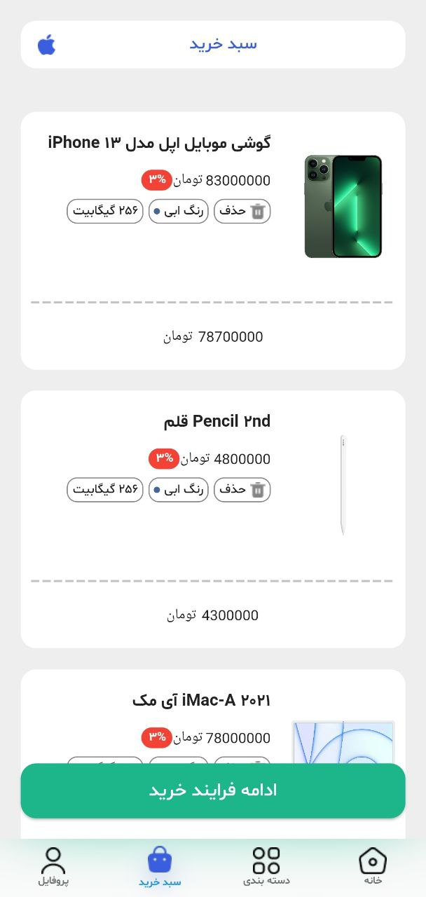
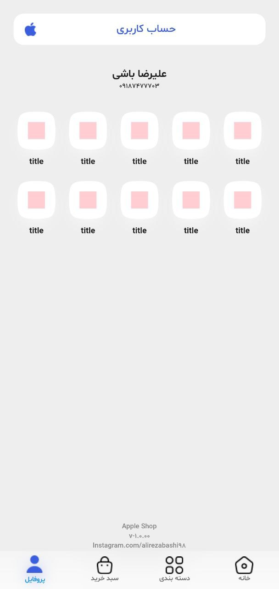

# flutter_apple_shop

A store written with Flutter <br>
* Bloc architecture 
* Dependency injection
* Hive database
* Rest api <br><br>
And ...

## screenshots

### android application ( mobile[android,ios] )

<p float="left">
  
  
  
  
  
  
</p>

## Developers
Please subscribe into our [Telegram channel](https://t.me/alirezabashi_98) and to conntact with the developer click this [link address.](https://t.me/alirezabashi98)

for flutter developers:
### Getting Started
```shel
https://github.com/alirezabashi98/apple-shope.gitcd alfa_coin
flutter pub get
flutter run 
```

For the rest of the operating systems, you can also use the following command, for example, for Linux as below, if there are several, put a comma between them as below

```shel
flutter create . --platforms=linux,android
```

this repo will be updated :blue_heart: .


## Links

* [Youtube channel](https://www.youtube.com/@alirezabashi98)
* [Instagram](https://instagram.com/alirezabashi98)
